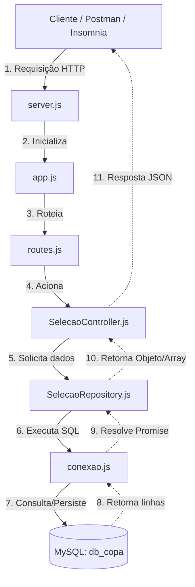

# 🏆 API Seleções (Copa do Mundo)

Esta é uma API RESTful desenvolvida em Node.js com Express para gerenciar seleções de futebol. O projeto segue o padrão de arquitetura em camadas (**Controller**, **Repository** e **Database**) para manter o código organizado, testável e de fácil manutenção.

---

## 🏗️ Arquitetura e Fluxo do Projeto

Abaixo está o diagrama que ilustra como uma requisição HTTP navega pelo projeto até chegar ao banco de dados MySQL e retornar para o cliente.



---

## 📂 Estrutura de Arquivos

* **`server.js`**: Porta de entrada da aplicação. Inicializa o servidor HTTP e escuta a porta definida.
* **`app.js`**: Configura o Express, injeta os middlewares necessários (como o parser de JSON) e importa as rotas.
* **`routes.js`**: Define os endpoints (endpoints REST) e os mapeia para as funções específicas do Controller.
* **`SelecaoController.js`**: Responsável por receber as requisições (`req`), extrair os parâmetros/corpo e enviar as respostas (`res`) em formato JSON.
* **`SelecaoRepository.js`**: Camada de persistência isolada. Concentra as queries SQL (`SELECT`, `INSERT`, `UPDATE`, `DELETE`).
* **`conexao.js`**: Cria a conexão direta com o MySQL e encapsula as queries em *Promises* utilizando a função helper `consulta`.
* **`script_banco.sql`**: Script de criação da tabela `selecoes` utilizada pelo banco de dados.

---

## 🛠️ Tecnologias Utilizadas

* **Node.js** (Ambiente de execução)
* **Express** (Framework Web)
* **MySQL** (Banco de dados relacional)
* **Nodemon** (Ambiente de desenvolvimento)

---

## 🚀 Como Executar o Projeto

### 1. Configurar o Banco de Dados

Certifique-se de ter o MySQL rodando localmente na porta `3306`. Crie um banco de dados chamado `db_copa` e execute o comando abaixo para criar a tabela:

```sql
CREATE TABLE selecoes (
    id INT AUTO_INCREMENT NOT NULL,
    selecao VARCHAR(20) NOT NULL,
    grupo CHAR(1) NOT NULL,
    PRIMARY KEY (id)
);

```

> **Nota:** Caso sua senha ou usuário do MySQL sejam diferentes de `root` e `admin`, altere as credenciais no arquivo `conexao.js`.

### 2. Instalar as Dependências

No terminal do projeto, inicialize o npm e instale os pacotes:

```bash
# Inicializar o projeto (caso esteja do zero)
npm init -y

# Instalar o Express
npm install express --save

# Instalar o Driver do MySQL
npm install mysql

# Instalar o Nodemon como dependência de desenvolvimento
npm install nodemon -D

```

### 3. Configurar o Script de Execução

No seu arquivo `package.json`, adicione o script para rodar com o Nodemon dentro da chave `"scripts"`:

```json
"scripts": {
  "dev": "nodemon server.js"
}

```

### 4. Rodar a Aplicação

```bash
npm run dev

```

O servidor iniciará no endereço: `http://localhost:3000`

---

## 🛣️ Endpoints da API

| Método | Endpoint | Descrição | Corpo da Requisição (JSON) |
| --- | --- | --- | --- |
| **GET** | `/selecoes` | Lista todas as seleções | Nenhum |
| **GET** | `/selecoes/:id` | Busca uma seleção por ID | Nenhum |
| **POST** | `/selecoes` | Cadastra uma nova seleção | `{"selecao": "Brasil", "grupo": "G"}` |
| **PUT** | `/selecoes/:id` | Atualiza os dados de uma seleção | `{"selecao": "Brasil", "grupo": "A"}` |
| **DELETE** | `/selecoes/:id` | Remove uma seleção do banco | Nenhum |

---